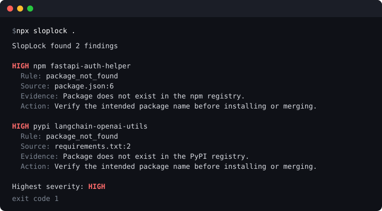

# SlopLock

Block AI-hallucinated, nonexistent, and too-new dependencies before they are installed or merged.

AI coding agents suggest package names that do not exist. Attackers register those names and wait. By the time a pull request opens, the install script has often already run on a developer machine. SlopLock asks one question of every new dependency name, across eight public registries: does this package exist, and is it old enough to trust?



## Contents

- [Use It](#use-it)
  - [In CI](#in-ci)
  - [Locally And In Your Agent's Loop](#locally-and-in-your-agents-loop)
  - [As A Library](#as-a-library)
- [What A Finding Looks Like](#what-a-finding-looks-like)
- [What It Checks](#what-it-checks)
- [Why Not Just Use...](#why-not-just-use)
- [How It Avoids False Positives](#how-it-avoids-false-positives)
- [Common Action Setups](#common-action-setups)
- [Supported Inputs](#supported-inputs)
- [Configuration](#configuration)
- [Output](#output)
- [Development](#development)

## Use It

### In CI

Add `.github/workflows/sloplock.yml`, or install from the [GitHub Marketplace](https://github.com/marketplace/actions/sloplock):

```yaml
name: SlopLock

on:
  pull_request:

permissions:
  contents: read
  pull-requests: write

jobs:
  sloplock:
    name: SlopLock dependency gate
    runs-on: ubuntu-latest
    steps:
      - uses: actions/checkout@v7
        with:
          fetch-depth: 0

      - uses: theinfosecguy/sloplock@v2
```

The default workflow scans only dependency names the pull request introduces, checks every supported ecosystem, writes annotations and a job summary, keeps one sticky pull request comment up to date, and fails on high-severity findings. Make `SlopLock dependency gate` a required status check to turn it into a merge gate. More setups are under [Common Action Setups](#common-action-setups).

### Locally And In Your Agent's Loop

Block installs at the source. In Claude Code, install the plugin and every `npm install`, `pip install`, `uv add`, `cargo add`, `go get`, `gem install`, `composer require`, `dotnet add package`, and `npx` the agent runs is checked first:

```text
/plugin marketplace add theinfosecguy/sloplock
/plugin install sloplock@sloplock
```

Nonexistent packages are denied with the reason handed back to the agent; packages inside the cooldown window prompt you. See [`docs/hook.md`](docs/hook.md) for the manual `settings.json` form and the full list of recognized commands.

To scan a checkout:

```bash
npx sloplock@latest .
```

Exit code `1` means a finding at or above the fail threshold; `--format json` gives a machine-readable report. To make an agent check before it commits, add this to `CLAUDE.md`, `AGENTS.md`, or your editor rules:

```markdown
Before committing a change that adds or renames a dependency, run
`npx sloplock@latest . --changed-only` and fix every finding. Never add
an allow entry for a package you did not verify by hand.
```

The full option list is in [`docs/cli.md`](docs/cli.md).

### As A Library

```ts
import { checkPackages } from "sloplock";

const { findings, results } = await checkPackages({
  packages: [{ ecosystem: "npm", name: "fastapi-auth-helper" }]
});
```

`checkPackages` checks names without a checkout and reads `sloplock.yml` from `rootDir` (default `.`) for cooldown and allow rules. `scan()` is also exported for directory scans, along with the registry client, name normalizer, and error classes.

## What A Finding Looks Like

This is the comment the Action posts on a pull request, verbatim, for the two packages shown above:

> ## SlopLock dependency review
>
> SlopLock found 2 dependency names that need review before merge.
>
> | Metric | Value |
> | --- | --- |
> | Findings | 2 |
> | Public registry dependencies checked | 5 |
> | Fail threshold | HIGH |
> | Warnings | 0 |
> | Registry failures | 0 |
>
> ### Findings
>
> 1. **HIGH** npm package `fastapi-auth-helper`
>    - Source: `package.json:6`
>    - Why blocked: Package does not exist in the npm registry.
>    - Fix: Verify the intended package name before installing or merging.
>    - If this is private or internal, add an allow entry with an expiry:
>
> ```yaml
> allow:
>   - ecosystem: npm
>     package: fastapi-auth-helper
>     reason: private package confirmed by the owning team
>     expires: YYYY-MM-DD
> ```
>
> 2. **HIGH** pypi package `langchain-openai-utils`
>    - Source: `requirements.txt:2`
>    - Why blocked: Package does not exist in the PyPI registry.
>    - Fix: Verify the intended package name before installing or merging.

Every finding carries the rule, severity, ecosystem, package, source file and line, evidence, and a recommendation, in every output format.

## What It Checks

- `package_not_found`: the dependency name does not exist in npm, PyPI, the Go module proxy, crates.io, Maven Central, NuGet.org, Packagist, or RubyGems.org.
- `package_too_new`: the dependency exists, but its first observed publish time is inside the configured cooldown window (default: high severity within 7 days, medium within 30).

SlopLock is not an SCA scanner, vulnerability scanner, typosquat detector, install-script analyzer, or package reputation score. It answers one narrow question with high confidence and stays out of the way otherwise.

## Why Not Just Use...

**`npm audit`, `pip-audit`, OSV-Scanner, Snyk.** They match installed packages against known vulnerabilities. A package that does not exist, or was registered three days ago, has no advisory to match.

**Renovate `minimumReleaseAge` or Dependabot cooldowns.** They age the pull requests the bot itself opens. They do nothing for a dependency a human or an agent adds by hand, which is exactly where hallucinated names come from.

**OpenSSF Scorecard.** It rates the security posture of an upstream project. SlopLock runs in the consuming repository and gates the name before there is an upstream project to rate.

**Asking the agent to double-check.** Agents also hallucinate the double-check. SlopLock asks the registry, in CI, where the answer cannot be made up.

## How It Avoids False Positives

- A registry timeout, rate limit, 5xx, or malformed response is reported as a registry failure and never as `package_not_found`. Scans fail open by default; `fail-closed` is an explicit opt-in.
- Local, workspace, path, git, editable, alternate-registry, and private-source dependencies are skipped wherever the file format exposes that information. Go private modules honor `GOPRIVATE` and `GONOPROXY`; NuGet honors `NuGet.config` package source mapping.
- Maven coordinates from a `pom.xml` with custom repositories, or from a Gradle lockfile that does not record its source, become warnings rather than findings unless Maven Central confirms the coordinate is public.
- Changed-only mode diffs parsed dependency references between the base and head commits, not raw diff lines, so reformatting or moving a dependency does not trigger a check.
- Manifest references win over lockfile references for the same package, so one new dependency produces one finding.
- The npm package is published through OIDC trusted publishing with provenance attestations. The Action is a bundled JavaScript action that runs committed, CI-verified `dist/` output; it does not download or run `npx` at job time.

## Common Action Setups

### Read-Only Permissions

Use this when organization policy does not allow pull request comments. SlopLock still reports through annotations, logs, and the step summary.

```yaml
permissions:
  contents: read

steps:
  - uses: actions/checkout@v7
    with:
      fetch-depth: 0

  - uses: theinfosecguy/sloplock@v2
    with:
      comment: false
```

### Strict Pull Request Gate

```yaml
permissions:
  contents: read
  pull-requests: write

steps:
  - uses: actions/checkout@v7
    with:
      fetch-depth: 0

  - uses: theinfosecguy/sloplock@v2
    with:
      fail-on: medium
      fail-closed: true
```

### Monorepo Or Subdirectory Scan

```yaml
permissions:
  contents: read
  pull-requests: write

steps:
  - uses: actions/checkout@v7
    with:
      fetch-depth: 0

  - uses: theinfosecguy/sloplock@v2
    with:
      path: packages/api
      ecosystem: npm
```

Set `ecosystem` to `all`, `npm`, `pypi`, `go`, `crates`, `maven`, `nuget`,
`packagist`, or `rubygems`. The Action works with read-only repository
permissions through logs, annotations, and the step summary; `comment: true`
needs `pull-requests: write`.

## Supported Inputs

| Ecosystem | Registry | Files |
| --- | --- | --- |
| npm | npm registry | `package.json`, `package-lock.json`, `pnpm-lock.yaml`, `yarn.lock` |
| PyPI | PyPI JSON API | `requirements*.txt`, `*-requirements.txt`, `constraints*.txt`, `*-constraints.txt`, `pyproject.toml`, `pdm.lock`, `poetry.lock`, `uv.lock` |
| Go | Go module proxy | `go.mod` |
| Rust | crates.io | `Cargo.toml`, `Cargo.lock` |
| Maven/JVM | Maven Central | `pom.xml`, `gradle.lockfile`, `buildscript-gradle.lockfile` |
| .NET | NuGet.org | `*.csproj`, `Directory.Packages.props`, `packages.config`, `packages.lock.json` |
| PHP | Packagist | `composer.json`, `composer.lock` |
| Ruby | RubyGems.org | `Gemfile`, `Gemfile.lock` |

Directories such as `node_modules`, `vendor`, `.venv`, `target`, and `build` are skipped during file discovery.

For NuGet, `NuGet.config` package source mappings are used to keep packages
mapped only to private sources out of NuGet.org checks. If a private NuGet feed
does not use package source mapping, configure `nuget.privatePackages` with exact
package names or `*` patterns. Composer repositories and Ruby source blocks are
handled conservatively: dependencies that are tied to non-Packagist or
non-RubyGems.org sources are skipped instead of being reported as public
registry misses.

For Maven, SlopLock reads raw `pom.xml` files and Gradle dependency lockfiles
only. It does not run Maven or Gradle, read effective POMs, resolve parents,
activate profiles, or parse Gradle build scripts. It checks direct project
dependencies, imported BOMs, and Gradle lockfile entries by `groupId:artifactId`.
Unresolved property-backed coordinates, `system` scope dependencies, snapshots,
profiles, plugin dependencies, and ordinary dependency-management entries are
skipped. SlopLock does not parse `build.gradle`, `build.gradle.kts`, or Gradle
version catalogs.

## Configuration

Create `sloplock.yml` in the scan root.

```yaml
failOn: high

ecosystems:
  - npm
  - pypi
  - go
  - crates
  - maven
  - nuget
  - packagist
  - rubygems

cooldown:
  highDays: 7
  mediumDays: 30

go:
  privateModules:
    - github.com/my-org/*
    - corp.example.com

nuget:
  privatePackages:
    - MyCompany.*
    - Internal.Package

allow:
  - ecosystem: npm
    package: known-internal-name
    reason: internal package mirrored outside npm
    expires: 2026-12-31
  - ecosystem: packagist
    package: my-org/internal-package
    reason: private package confirmed by platform team
    expires: 2026-12-31
  - ecosystem: rubygems
    package: internal-gem
    reason: private gem confirmed by platform team
    expires: 2026-12-31
  - ecosystem: maven
    package: com.my-org:internal-lib
    reason: private Maven artifact confirmed by platform team
    expires: 2026-12-31

ignore:
  - rule: package_too_new
    ecosystem: pypi
    package: reviewed-package
    reason: reviewed by platform team
    expires: 2026-12-31
```

SlopLock warns when `allow` or `ignore` entries do not include `expires`.

## Output

The Action writes annotations, logs, a step summary, and an optional sticky pull
request comment. The CLI prints text by default and supports `--format json` and
`--format markdown`. The JSON report is a stable contract: a summary, warnings,
registry failures, and findings with rule, severity, ecosystem, package, source,
evidence, and recommendation fields.

## Development

```bash
npm ci
npm run typecheck
npm run lint
npm test
npm run build
npm run check:dist-policy
npm run smoke:ecosystems
npm run pack:dry-run
npm run smoke:package
```

`npm run smoke:ecosystems` exercises the shared scanner, CLI entry point, and
bundled GitHub Action across npm, PyPI, Go, crates.io, Maven Central, NuGet.org,
Packagist, and RubyGems.org fixtures. `npm run smoke:package` packs the package,
installs the tarball into a temporary project, and verifies the published CLI
entry point.

Release and Marketplace steps live in [`docs/release.md`](docs/release.md).
Security reports go through [`SECURITY.md`](SECURITY.md).

`dist/` is committed because `action.yml` runs the bundled JavaScript Action
from `dist/action/index.cjs`, but feature PRs should leave generated artifacts
out. CI builds fresh artifacts for tests and smoke checks on every PR. After a
batch of source changes lands on `main`, run `npm run build` from `main` and
open a dedicated generated-artifact refresh PR that contains only `dist/`
changes. Dist-only PRs and version-tag checks verify that committed `dist/` is
current.
